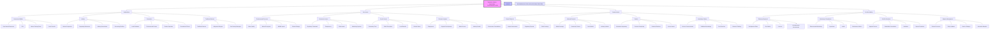

```mermaid
flowchart TB
    %% Main Topics with simplified styling
    A["Tasmanian Salmon Aquaculture
    Environmental Conflict"]
    B[Stakeholders]
    C[Core Issues]
    D[Communication]
    E[Decision-Making]

    %% Main connections
    A --> B
    A --> C
    A --> D
    A --> E

    %% Stakeholders
    B1[Government Bodies]
    B2[Industry]
    B3[Community]
    B4[Traditional Owners]
    
    B --> B1
    B --> B2
    B --> B3
    B --> B4
    
    B1a[Dept Natural Resources]
    B1b[EPA]
    B1c[Marine Farming Panel]
    B1d[Local Councils]
    
    B1 --> B1a
    B1 --> B1b
    B1 --> B1c
    B1 --> B1d
    
    B2a[Salmon Companies]
    B2b[Supporting Businesses]
    B2c[Industry Associations]
    B2d[Processing Facilities]
    
    B2 --> B2a
    B2 --> B2b
    B2 --> B2c
    B2 --> B2d
    
    B3a[Local Residents]
    B3b[Environmental Groups]
    B3c[Tourism Operators]
    B3d[Recreational Fishers]
    
    B3 --> B3a
    B3 --> B3b
    B3 --> B3c
    B3 --> B3d
    
    B4a[Traditional Owners]
    B4b[Indigenous Rangers]
    B4c[Sea Country Managers]
    
    B4 --> B4a
    B4 --> B4b
    B4 --> B4c

    %% Core Issues
    C1[Environmental Concerns]
    C2[Governance Issues]
    C3[Social License]
    C4[Economic Impacts]
    
    C --> C1
    C --> C2
    C --> C3
    C --> C4
    
    C1a[Water Quality]
    C1b[Marine Ecosystem]
    C1c[Wildlife Impact]
    C1d[Climate Change]
    
    C1 --> C1a
    C1 --> C1b
    C1 --> C1c
    C1 --> C1d
    
    C2a[Regulatory Framework]
    C2b[Transparency]
    C2c[Enforcement]
    C2d[Monitoring Systems]
    
    C2 --> C2a
    C2 --> C2b
    C2 --> C2c
    C2 --> C2d
    
    C3a[Community Trust]
    C3b[Public Perception]
    C3c[Local Benefits]
    C3d[Cultural Values]
    
    C3 --> C3a
    C3 --> C3b
    C3 --> C3c
    C3 --> C3d
    
    C4a[Employment]
    C4b[Regional Development]
    C4c[Market Access]
    C4d[Industry Growth]
    
    C4 --> C4a
    C4 --> C4b
    C4 --> C4c
    C4 --> C4d

    %% Communication
    D1[Formal Channels]
    D2[Informal Channels]
    D3[Barriers]
    D4[Knowledge Sharing]
    
    D --> D1
    D --> D2
    D --> D3
    D --> D4
    
    D1a[Government Consultations]
    D1b[Impact Assessments]
    D1c[Regulatory Reports]
    D1d[Public Hearings]
    
    D1 --> D1a
    D1 --> D1b
    D1 --> D1c
    D1 --> D1d
    
    D2a[Media Coverage]
    D2b[Community Forums]
    D2c[Social Media]
    D2d[Industry Updates]
    
    D2 --> D2a
    D2 --> D2b
    D2 --> D2c
    D2 --> D2d
    
    D3a[Information Asymmetry]
    D3b[Technical Complexity]
    D3c[Polarized Positions]
    D3d[Access Issues]
    
    D3 --> D3a
    D3 --> D3b
    D3 --> D3c
    D3 --> D3d
    
    D4a[Science Communication]
    D4b[Traditional Knowledge]
    D4c[Best Practices]
    D4d[Research Findings]
    
    D4 --> D4a
    D4 --> D4b
    D4 --> D4c
    D4 --> D4d

    %% Decision-Making
    E1[Planning & Approval]
    E2[Monitoring & Compliance]
    E3[Conflict Resolution]
    E4[Adaptive Management]
    
    E --> E1
    E --> E2
    E --> E3
    E --> E4
    
    E1a[Development Plans]
    E1b[Site Studies]
    E1c[Licenses]
    E1d[Environmental Assessments]
    
    E1 --> E1a
    E1 --> E1b
    E1 --> E1c
    E1 --> E1d
    
    E2a[Environmental Monitoring]
    E2b[Inspections]
    E2c[Audits]
    E2d[Performance Metrics]
    
    E2 --> E2a
    E2 --> E2b
    E2 --> E2c
    E2 --> E2d
    
    E3a[Appeals Process]
    E3b[Stakeholder Consultation]
    E3c[Mediation]
    E3d[Dispute Resolution]
    
    E3 --> E3a
    E3 --> E3b
    E3 --> E3c
    E3 --> E3d
    
    E4a[Review Processes]
    E4b[Policy Updates]
    E4c[Practice Changes]
    E4d[Innovation Adoption]
    
    E4 --> E4a
    E4 --> E4b
    E4 --> E4c
    E4 --> E4d

    %% Simple styling for better SVG export
    style A fill:#ff99ff,stroke:#333,stroke-width:4px
    style B,C,D,E fill:#bbbbff,stroke:#333,stroke-width:2px
    style B1,B2,B3,B4,C1,C2,C3,C4,D1,D2,D3,D4,E1,E2,E3,E4 fill:#ddddff,stroke:#333,stroke-width:1px
``` 